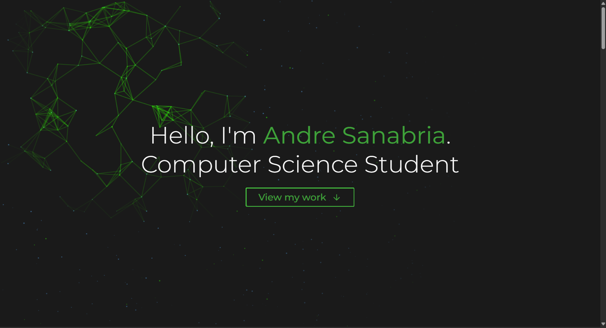

# 💼 Andre Sanabria Portfolio

Welcome to my personal portfolio website, built to showcase my projects, skills, and experience as a Computer Science student.

[🔗 Live Website](https://portfolio-website-alpha-ashen.vercel.app/)  

---

## 🖥️ Tech Stack

- **HTML5 / SCSS (Sass)**
- **JavaScript (Vanilla)**
- **Canvas API**
- **Webpack** (Module bundler)
- **Responsive Design**
- **Git & GitHub Pages** (Version control & deployment)

---

## 📸 Screenshots

| Home Page | Projects Section |
|-----------|------------------|
|  |  |

_Add real screenshots from your site to the `/assets` folder and reference them above._

---

## 📂 Folder Structure

```
Personal-Website-Andre/
├── .vs/
|   ├── slnx.sqlite/
├── dist/
│   ├── index.html   
│   ├── main.baeff80a01a01d327c9e.js.  
│   ├── main.baeff80a01a01d327c9e.js.LICENSE.txt   
│   └── main.f8d128fed3c44f509c95.css  
├── src/
│   ├── assets/
│   ├── canvas/   
│   ├── sass/    
│   ├── index.js  
│   ├── heroCanvas.js  
│   └── template.html    
├── webpack.dev.js 
├── package.json
├── webpack.common.js 

```

## 📌 Features

- Animated hero canvas using JavaScript + Canvas API
- Modular SCSS with variables and media queries
- Fully responsive across devices
- Clean and professional UI
- Easy deployment via GitHub Pages

---
